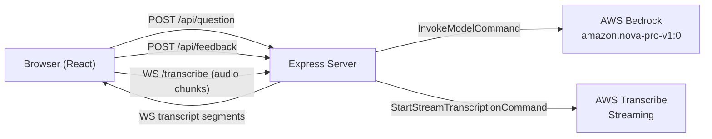

# Design Document: Interview Coach

## Overview

The Interview Coach is a local, single-user web application that helps college students practice behavioral interview responses using the STAR format. The user generates a question, records a spoken answer, sees a live transcription, and receives AI-generated feedback — all in one page.

The system is a two-process application: a React (Vite) frontend and a Node.js/Express backend. The backend owns all AWS communication (Bedrock for LLM calls, Transcribe Streaming for speech-to-text). The frontend communicates with the backend via two REST endpoints and one WebSocket connection.



---

## Architecture

### Process Layout

| Process         | Port | Responsibility                                                |
| --------------- | ---- | ------------------------------------------------------------- |
| Vite dev server | 5173 | Serves React SPA, proxies `/api` and `/transcribe` to backend |
| Express server  | 3001 | REST API, WebSocket server, AWS SDK calls                     |

Vite's `server.proxy` config forwards `/api/*` (HTTP) and `/transcribe` (WS) to `localhost:3001`, so the browser never needs to know the backend port.

### Request Flow

**Question generation:**

1. User clicks "Generate Question"
2. `POST /api/question` → Express → `BedrockRuntimeClient.InvokeModelCommand`
3. Response JSON `{ question: string }` returned to frontend

**Feedback analysis:**

1. Session ends with non-empty transcript
2. `POST /api/feedback` with `{ question, transcript }` → Express → `BedrockRuntimeClient.InvokeModelCommand`
3. Response JSON `{ feedback: FeedbackReport }` returned to frontend

**Real-time transcription:**

1. Session starts → browser opens WebSocket to `/transcribe`
2. `MediaRecorder` sends audio chunks (≤250 ms) as binary frames over WS
3. Express WS handler pipes chunks into `TranscribeStreamingClient.StartStreamTranscriptionCommand`
4. Transcribe returns partial/final segments → forwarded as JSON text frames to browser
5. Session stops → browser closes WS

---

## Components and Interfaces

### Frontend Components

```
src/
  App.jsx                  — root layout, global state
  components/
    QuestionPanel.jsx      — displays question, "Generate Question" button
    SessionControls.jsx    — "Start Practice Session" / "Stop Session" buttons
    Timer.jsx              — MM:SS elapsed time display
    TranscriptionDisplay.jsx — live transcript text area
    FeedbackPanel.jsx      — renders FeedbackReport
  hooks/
    useSession.js          — session state machine, MediaRecorder, WebSocket lifecycle
    useQuestion.js         — question fetch, loading/error state
    useFeedback.js         — feedback fetch, loading/error state
```

**App.jsx** owns the shared state and passes props/callbacks down:

```
sessionState: 'idle' | 'recording' | 'stopped'
question: string | null
transcript: string
feedback: FeedbackReport | null
errors: { question, transcription, feedback }
```

**useSession** manages the session lifecycle:

- Opens `MediaRecorder` on start
- Opens WebSocket to `/transcribe`
- Accumulates transcript segments
- On stop: closes WS, triggers feedback fetch

**useQuestion** calls `POST /api/question`, manages `loading` and `error`.

**useFeedback** calls `POST /api/feedback`, manages `loading` and `error`.

### Backend Modules

```
server/
  index.js          — Express app setup, env validation, HTTP + WS server
  routes/
    question.js     — POST /api/question handler
    feedback.js     — POST /api/feedback handler
  services/
    bedrock.js      — BedrockRuntimeClient wrapper (generateQuestion, analyzeFeedback)
    transcribe.js   — TranscribeStreamingClient wrapper, WS↔stream bridge
```

### API Contracts

**POST /api/question**

- Request: `{}` (empty body)
- Response 200: `{ "question": "Tell me about a time you led a team under pressure." }`
- Response 500: `{ "error": "descriptive message" }`

**POST /api/feedback**

- Request: `{ "question": string, "transcript": string }`
- Response 200: `{ "feedback": FeedbackReport }`
- Response 500: `{ "error": "descriptive message" }`

**WS /transcribe**

- Client → Server: binary audio frames (PCM/WebM chunks from MediaRecorder)
- Server → Client: JSON text frames `{ "type": "transcript", "text": string, "isFinal": boolean }`
- Server → Client on error: `{ "type": "error", "message": string }`

---

## Data Models

### FeedbackReport

```typescript
interface STARComponent {
  present: boolean;
  notes: string; // brief description of what was found or missing
}

interface FeedbackReport {
  star: {
    situation: STARComponent;
    task: STARComponent;
    action: STARComponent;
    result: STARComponent;
  };
  strengths: string; // paragraph, coach-like tone
  areasForImprovement: string; // paragraph
  actionableTips: string[]; // 2–3 items
}
```

### Bedrock Request/Response

The backend uses the Converse-style messages API for `amazon.nova-pro-v1:0`:

```json
{
  "modelId": "amazon.nova-pro-v1:0",
  "messages": [{ "role": "user", "content": [{ "text": "<prompt>" }] }],
  "inferenceConfig": { "maxTokens": 512, "temperature": 0.7 }
}
```

The model response is parsed from `output.message.content[0].text`. For feedback, the prompt instructs the model to return a JSON object matching `FeedbackReport`; the backend parses it with `JSON.parse`.

### Transcription WebSocket Message

```typescript
interface TranscriptMessage {
  type: "transcript" | "error";
  text?: string; // present when type === "transcript"
  isFinal?: boolean; // true for final segments
  message?: string; // present when type === "error"
}
```

### Environment Variables

| Variable                | Required | Description                                   |
| ----------------------- | -------- | --------------------------------------------- |
| `AWS_ACCESS_KEY_ID`     | yes      | AWS credential                                |
| `AWS_SECRET_ACCESS_KEY` | yes      | AWS credential                                |
| `AWS_SESSION_TOKEN`     | no       | AWS session token (for temporary credentials) |
| `PORT`                  | no       | Express port, defaults to 3001                |

---

## Correctness Properties

_A property is a characteristic or behavior that should hold true across all valid executions of a system — essentially, a formal statement about what the system should do. Properties serve as the bridge between human-readable specifications and machine-verifiable correctness guarantees._

### Property 1: Timer format is always MM:SS

_For any_ non-negative integer number of elapsed seconds, the timer formatting function shall return a string matching the pattern `MM:SS` where MM and SS are zero-padded two-digit numbers.

**Validates: Requirements 2.3**

---

### Property 2: Button states are consistent with session state

_For any_ session state (`idle`, `recording`, `stopped`), the "Start Practice Session" button is enabled if and only if the session is not recording, and the "Stop Session" button is enabled if and only if the session is recording.

**Validates: Requirements 2.5, 2.6, 2.7**

---

### Property 3: Bedrock errors produce a 500 response with a non-empty error message

_For any_ error thrown by the BedrockRuntimeClient (network failure, throttling, invalid response, etc.), the corresponding API endpoint (`/api/question` or `/api/feedback`) shall return HTTP 500 with a JSON body containing a non-empty `error` string.

**Validates: Requirements 1.5, 4.7**

---

### Property 4: WebSocket disconnect during session sets an error message

_For any_ active practice session, if the WebSocket connection closes or errors unexpectedly (i.e., before the user clicks "Stop Session"), the application state shall contain a non-empty transcription error message.

**Validates: Requirements 3.7**

---

### Property 5: Transcript is retained after session stop

_For any_ accumulated transcript string at the time the user clicks "Stop Session", the transcript displayed after the session ends shall equal that same string (it is not cleared by the stop action).

**Validates: Requirements 3.6**

---

### Property 6: Non-empty transcript triggers feedback request

_For any_ practice session that ends with a non-empty transcript string, the application shall invoke the feedback API exactly once with that transcript and the current question.

**Validates: Requirements 4.1**

---

### Property 7: Empty transcript suppresses feedback request

_For any_ practice session that ends with an empty transcript string, the application shall not invoke the feedback API and shall display a "no speech detected" message in the feedback panel.

**Validates: Requirements 4.8**

---

### Property 8: FeedbackReport structure is always complete

_For any_ FeedbackReport returned by the Feedback_Analyzer, the object shall contain all four STAR keys (`situation`, `task`, `action`, `result`), each with a boolean `present` field and a `notes` string; a non-empty `strengths` string; a non-empty `areasForImprovement` string; and an `actionableTips` array containing exactly 2 or 3 items.

**Validates: Requirements 4.3, 4.4**

---

### Property 9: Generating a new question clears transcript and feedback

_For any_ application state where a transcript or feedback report is present, successfully generating a new question shall reset both the transcript display and the feedback panel to their empty/placeholder states.

**Validates: Requirements 5.6**

---

### Property 10: Missing required environment variable causes startup failure

_For any_ combination of environment variables where `AWS_ACCESS_KEY_ID` or `AWS_SECRET_ACCESS_KEY` is absent, the server startup validation function shall throw an error (or call `process.exit`) with a descriptive message identifying the missing variable.

**Validates: Requirements 6.6**

---

### Property 11: MediaRecorder timeslice does not exceed 250 ms

_For any_ practice session start, the `MediaRecorder` shall be initialized with a `timeslice` value less than or equal to 250 milliseconds.

**Validates: Requirements 3.2**

---

### Property 12: WebSocket bridge forwards audio and transcript bidirectionally

_For any_ binary audio frame received by the WebSocket server, it shall be written to the Transcribe input stream; and for any transcript event emitted by the Transcribe output stream, a corresponding JSON text frame shall be sent to the WebSocket client.

**Validates: Requirements 3.3, 3.4**

---

## Error Handling

### Frontend

| Scenario                           | Handling                                                                                      |
| ---------------------------------- | --------------------------------------------------------------------------------------------- |
| `POST /api/question` fails         | Set `errors.question` with response `error` field; display in QuestionPanel; re-enable button |
| Microphone access denied           | Set `errors.transcription`; keep session in `idle` state                                      |
| WebSocket closes unexpectedly      | Set `errors.transcription`; session transitions to `stopped`                                  |
| `POST /api/feedback` fails         | Set `errors.feedback` with response `error` field; display in FeedbackPanel                   |
| Session ends with empty transcript | Skip feedback call; display "no speech detected" in FeedbackPanel                             |

All error messages are displayed inline in the relevant panel. There are no modal dialogs or toast notifications.

### Backend

| Scenario                                    | Handling                                                                                        |
| ------------------------------------------- | ----------------------------------------------------------------------------------------------- |
| Bedrock call throws                         | Catch, log to console, return `{ error: err.message }` with HTTP 500                            |
| Bedrock returns unparseable JSON (feedback) | Catch `JSON.parse` error, return `{ error: "Failed to parse feedback response" }` with HTTP 500 |
| Transcribe stream error                     | Emit `{ type: "error", message: err.message }` over WS, close WS connection                     |
| Missing env vars at startup                 | Log each missing variable name, call `process.exit(1)`                                          |

---

## Testing Strategy

### Dual Testing Approach

Both unit tests and property-based tests are used. Unit tests cover specific examples, integration points, and edge cases. Property-based tests verify universal invariants across randomized inputs.

> Note: Per project constraints, no test infrastructure is implemented during the workshop. This section documents the intended testing strategy for future implementation.

### Property-Based Testing

**Library**: [fast-check](https://github.com/dubzzz/fast-check) (JavaScript/TypeScript)

Each property test runs a minimum of **100 iterations**. Each test is tagged with a comment referencing the design property it validates.

Tag format: `// Feature: interview-coach, Property {N}: {property_text}`

| Property                                   | Test Description                                                                                        | Arbitraries        |
| ------------------------------------------ | ------------------------------------------------------------------------------------------------------- | ------------------ |
| P1: Timer format                           | `fc.integer({ min: 0, max: 5999 })` → assert output matches `/^\d{2}:\d{2}$/`                           | `fc.integer`       |
| P2: Button state invariant                 | `fc.constantFrom('idle','recording','stopped')` → assert button enabled states                          | `fc.constantFrom`  |
| P3: Bedrock error → 500                    | Mock Bedrock to throw `fc.string()` error → assert HTTP 500 + non-empty `error`                         | `fc.string`        |
| P4: WS disconnect → error state            | Simulate unexpected WS close → assert error message non-empty                                           | mock WS            |
| P5: Transcript retained on stop            | `fc.string()` transcript → stop session → assert transcript unchanged                                   | `fc.string`        |
| P6: Non-empty transcript triggers feedback | `fc.string({ minLength: 1 })` → stop → assert feedback called once                                      | `fc.string`        |
| P7: Empty transcript suppresses feedback   | Empty transcript → stop → assert feedback not called                                                    | constant           |
| P8: FeedbackReport structure               | Mock Bedrock returning `fc.record(...)` → assert all fields present, tips 2–3                           | `fc.record`        |
| P9: New question clears state              | Any transcript + feedback state → generate question → assert both cleared                               | `fc.string`        |
| P10: Missing env var exits                 | `fc.subarray(['AWS_ACCESS_KEY_ID','AWS_SECRET_ACCESS_KEY'])` → assert exit/throw                        | `fc.subarray`      |
| P11: MediaRecorder timeslice ≤ 250 ms      | Start session → assert MediaRecorder constructed with timeslice ≤ 250                                   | mock MediaRecorder |
| P12: WS bridge bidirectional               | `fc.uint8Array()` audio → assert Transcribe write called; mock Transcribe event → assert WS send called | `fc.uint8Array`    |

### Unit Tests

Unit tests focus on specific examples and integration points that properties don't cover:

- **API endpoint existence**: `GET /api/question` returns 404 (wrong method), `POST /api/question` returns 200 with `question` field (mocked Bedrock)
- **FeedbackReport parsing**: Given a known Bedrock JSON response string, `parseFeedback()` returns the correct structured object
- **Env validation**: Given all required vars present, startup proceeds without error
- **WS endpoint**: A WebSocket connection to `/transcribe` is accepted (connection upgrade succeeds)
- **Idle state placeholder**: On initial render, transcription and feedback panels show placeholder text (Req 5.5)
- **Single-page layout**: Rendered app contains question area, both buttons, timer, transcription area, and feedback panel (Req 5.1)

### Coverage Goals

- All 12 correctness properties covered by property-based tests
- All 6 API/config examples covered by unit tests
- Error paths (Req 1.5, 2.2, 3.7, 4.7, 4.8, 6.6) covered by dedicated tests
